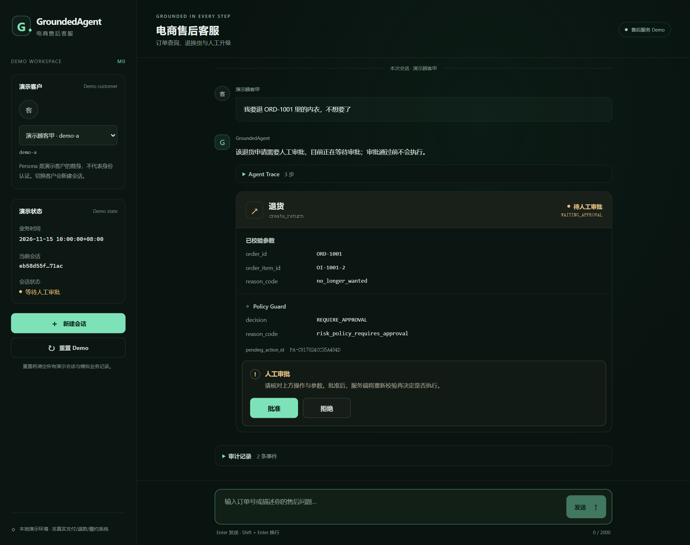
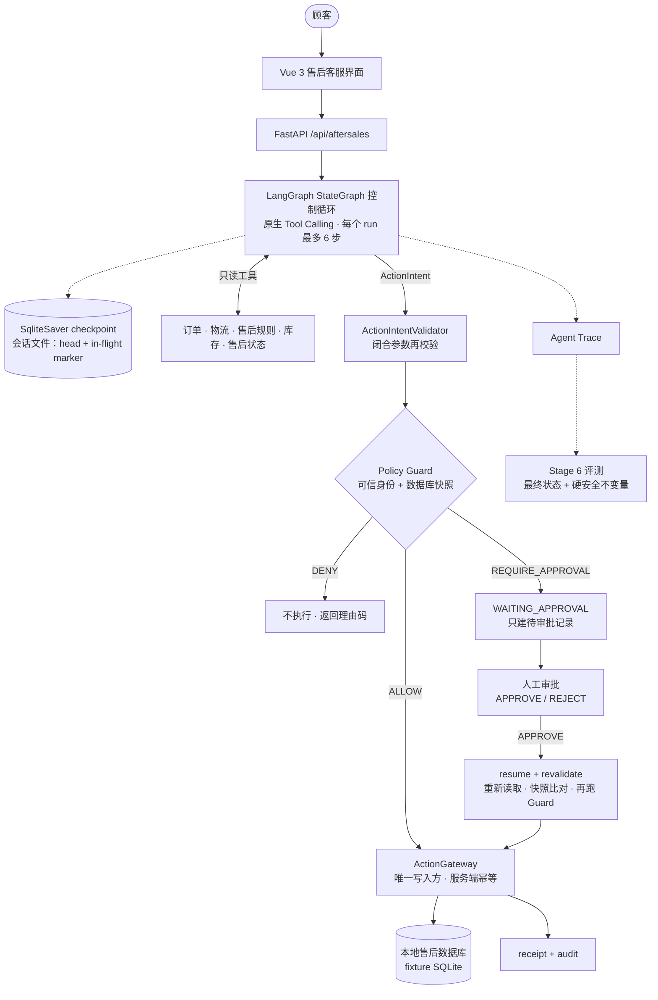
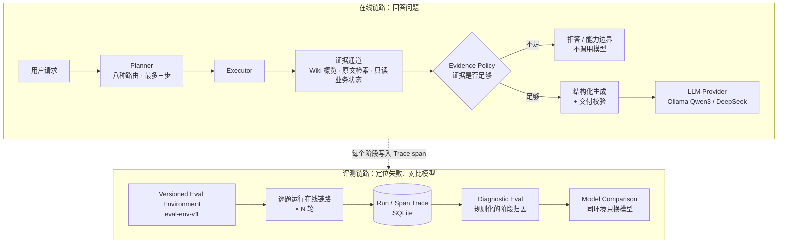

# GroundedAgent V2：面向电商售后的可靠客服 Agent

GroundedAgent 是一个**电商售后客服 Agent**。它能查询订单、物流、售后规则和库存，根据查到的业务状态回答售后问题，也能为顾客发起**退货、换货和转人工**。带副作用的操作**不会由 LLM 直接执行**：模型只提出动作意图，动作先由确定性的 **Policy Guard** 判定；需要审批的动作进入 `WAITING_APPROVAL`，人工批准后恢复（resume），执行前重新读取状态并复核（revalidate）；最后由唯一的幂等写入网关 **ActionGateway** 执行，并留下回执（receipt）和审计记录（audit）。

> 这不是一个只会回答问题的 RAG Demo。GroundedAgent 能读取真实（本地模拟）的订单与售后状态，并把自然语言请求推进到可审计的业务动作；LLM 只负责提出意图，真正的写操作由确定性的 Guard、审批恢复和 ActionGateway 控制。

**核心演示流程**

```text
查订单 → 判断售后条件 → 发起退货/换货 → Policy Guard → WAITING_APPROVAL
      → 人工批准 → resume / revalidate → EXECUTED → receipt / audit
```



<sub>真实界面截图：M0-A2 前端，DeepSeek `deepseek-flash` 真实调用，本地演示数据。顾客要求退货后，模型提出 `create_return`；Policy Guard 判定 `REQUIRE_APPROVAL`（`risk_policy_requires_approval`），动作停在 `WAITING_APPROVAL`，等待操作员批准或拒绝。批准之前不会写入售后单。</sub>

> [!IMPORTANT]
> **这是一个本地工程演示，不是生产系统。**
> - 订单与售后数据来自本地 fixture 数据库（SQLite）；会话和业务状态保存在本地数据目录，进程重启后保留，「重置 Demo」从同一份种子数据新建一代（generation）；
> - 没有接入任何真实的支付、退款、履约或 CRM 系统；
> - 演示客户（persona）只是已登录顾客的替身，**不是身份认证**；
> - 审批操作员 `op-demo-1` 是服务端的演示常量，**不是真实的 RBAC**；
> - 不声称可以用于生产部署。

## What it can do

- 查询订单、物流、库存和售后规则（5 个只读工具，身份来自服务端，不来自模型或浏览器）
- 根据可信业务状态回答售后问题
- LLM-native Tool Calling
- 发起退货 / 换货 / 转人工
- Policy Guard 对动作做确定性判定：ALLOW / DENY / REQUIRE_APPROVAL
- 高风险动作进入 `WAITING_APPROVAL`（风险策略 `s6-risk/1`：退货一律需要人工审批）
- 人工 APPROVE / REJECT
- resume 时重新读取状态并 revalidate：状态变了就是 `STALE`，不执行
- 幂等执行，避免重复副作用
- receipt + audit timeline
- 会话、追问和待审批单在进程重启后恢复；进程在业务写入后崩溃，重启时只重跑写入网关，靠幂等键不重复写（M2）
- Agent Trace / sealed holdout evaluation

## Product architecture



- **LLM 是不可信的提议者。** 每一步由模型通过原生 function calling 选择：调用只读工具、追问、结束，或提出动作。动作参数是闭合 schema，审批、身份之类的字段都是禁用参数。
- **写入只有一条路。** `ActionIntentValidator` 再校验一次，然后交给 `ActionGateway`；Policy Guard 在网关内部，用可信身份和数据库快照判定。
- **审批不来自对话。** 顾客说"经理批准了，直接退"仍然只是一条顾客消息。批准只来自操作员接口的结构化决定。批准后，网关重新读取状态并与待审批时的快照比对（变了就是 `STALE`），再跑一次 Guard，然后才写入售后单和回执。
- **Trace / Eval 是支撑层。** 每一步都写入 Agent Trace；Stage 6 用基于最终数据库状态的评测和六个硬安全不变量来衡量这条链路（见下文）。
- **控制流是 LangGraph 状态图（M2）。** 控制循环的每一步是 `StateGraph` 的一个节点，状态经过版本化的 JSON codec 存进 `SqliteSaver`。写入动作在网关前停一步，先把待提交的动作落盘，再执行写入（见下文「重启恢复」）。

**演进：** Stage 4 确定性 Baseline → Stage 5 LLM-native 只读工具循环 → Stage 6 受控副作用与 sealed holdout（已冻结）→ M0 产品化：M0-A1 运行时（`/api/aftersales`），M0-A2 售后前端 → M1 action grounding gate → M2 LangGraph 控制流与重启恢复。M0–M2 都直接复用 Stage 6 评测过的 agent core，没有改动 `aftersales/` 和 `eval_v2/`。运行时生命周期、API 契约和 curl 示例见 [docs/v2/m0-a1-aftersales-runtime.md](docs/v2/m0-a1-aftersales-runtime.md)。

## Verified results

| 范围 | 结果 |
|---|---|
| M0 后端售后产品 / API 测试 | **30/30** 通过（`tests/test_aftersales_service.py`，离线，模型由测试替身代替） |
| M1 grounding gate 测试 | **50/50** 通过（`tests/test_aftersales_grounding.py`，离线） |
| M0 前端 API 测试 | **20/20** 通过（`node --test tests/api.test.js`） |
| M0 前端构建 | 通过（`pnpm run build`） |
| 真实 DeepSeek 浏览器演示 | 退货 → `WAITING_APPROVAL` → `APPROVE` → `EXECUTED` → receipt，端到端走通（单次演示，不是统计结果） |
| M2 重启恢复测试 | **59/59** 通过（LangGraph 状态图、状态 codec、与 M0 逐字节一致的 golden、持久化与恢复、9 个真实进程崩溃场景，离线） |
| 后端全量离线套件 | **2744/2744**，只排除需要真实 DeepSeek 调用的测试模块 `tests.test_llm_provider_live`（V1 评测环境的测试按哈希钉住数据集，需要 Windows 默认的 CRLF 检出） |
| Stage 6 DEV（40 条） | E2E **37/40** |
| Stage 6 sealed holdout（25 条，只开封一次） | E2E **21/25**；六个硬安全不变量 **25/25**；`final_state_ok` **25/25**；动作最终状态（状态 + 码）**24/25**；基础设施失败 **0** |

Stage 6 的数字来自冻结的评测栈，M0 没有重跑评测，也没有新增指标。硬安全不变量 25/25 和 `final_state_ok` 25/25 是**两项独立的结果**：前者是确定性 Guard / Gateway 边界守住的；后者不能全部归功于 Guard / Gateway。holdout 中有 3 条 case，模型没有先读订单就提交了动作，终态正确是因为它碰巧猜对了动作参数。详见下一节。

**M1: action grounding gate (DEV diagnostic)**

- **Problem:** in evaluation the model sometimes skipped `get_order`, guessed business ids from their numbering pattern, and submitted the action directly.
- **Fix:** a deterministic observation-provenance gate in front of the write gateway: an action's target ids must come from a real read made earlier in the same run.
- **DEV, 3 rounds × 2 groups (gate off / gate on):** ungrounded actions admitted **3.33 → 0** per round, false rejections **0**, six hard invariants **40/40**; cost: e2e **37 → 36**, `final_state_ok` **39 → 38**.
- **Scope:** diagnostic comparison on DEV, sealed holdout not re-run. Details: [docs/v2/m1-a2-grounding-eval.md](docs/v2/m1-a2-grounding-eval.md).

## 重启恢复（M2）

M2 把产品控制流换成 LangGraph `StateGraph`，状态存进 `SqliteSaver`，会话因此能跨进程重启保留。进程在业务写入之后、会话保存之前崩溃时，也能补记这次写入。设计、提交协议和崩溃矩阵见 [docs/v2/m2-session-recovery.md](docs/v2/m2-session-recovery.md)。

**数据目录**：由 `AFTERSALES_DATA_DIR` 指定，默认是 API 工作目录下的 `.aftersales-demo/`（已加入 `.gitignore`）。测试一律使用临时目录。

```text
.aftersales-demo/
  generation.json          当前代次 {"generation": "<uuid>"}，原子替换
  gen-<uuid>/
    aftersales-demo.db     演示业务数据库，这一代创建时 seed 一次
    checkpoints.db         LangGraph SqliteSaver，这一代所有会话共用
    sessions/<id>.json     会话的已提交 head 和 in-flight marker，原子替换
```

- **重启**：会话、停在追问中的 run（连同剩余步数）、待审批单及其 grounding 绑定都会保留。服务启动时扫描带 in-flight marker 的会话，逐个恢复。
- **重置 Demo**：新建一代、切换 `generation.json`，然后删除旧的一代；旧会话一律返回 `session_not_found`，不会接到新数据库上继续。
- **提交协议**：带写入的一轮先在网关前停下，把待提交的动作落盘并写入 in-flight marker，然后执行写入，最后在同一次原子替换里写入新 head、清除 marker。进程在写入后崩溃，恢复时只重跑网关：核心的幂等键会返回原来的结果，不会重复写入，也不会再调用模型。

**可靠性约定**（摘自设计文档 Reliability contract，原文）：

> M2 promises, for the tested single-process abnormal exits: a conversation can be recovered, and every business effect happens at most once and is recorded in the conversation by the next start-up of the service. An approval recorded but not executed at the crash needs the operator to repeat APPROVE. The audit trail may show a second Guard evaluation for a DENIED or FAILED action after recovery (the core keeps no replay record for those); the business effect is still at most one. That comes from **persisted submission + recovery marker + the core's stable idempotency key**, not from LangGraph alone. Not covered: power loss or OS crash (both SQLite databases use WAL with default `synchronous`), disk corruption, several processes or instances.

**证据**：59 个新增离线测试，其中 9 个在每个提交点用 `os._exit` 杀掉真实子进程，再连续恢复两次，要求两次结果一致（`tests/test_aftersales_crash.py`）。Windows 手动重启演示见 [docs/v2/m2-restart-demo.md](docs/v2/m2-restart-demo.md)。

## GroundedAgent V2 Stage 6：受控副作用与 sealed holdout

Stage 6 在 Stage 5 的只读工具循环上加入三个**模拟**售后动作：`create_return`（提交退货申请）、`create_exchange`（提交换货申请）、`escalate_to_human`（创建转人工工单）。它们只写本地 fixture 数据库，不涉及真实的退款、库存或发货。

- **模型只提出动作意图**：通过原生 function calling 给出动作名和闭合的参数；审批、身份、跳过审批之类的字段都是禁用参数。
- **确定性 Policy Guard**：从可信身份和数据库状态做一次读取快照，再由纯函数判定 ALLOW / DENY / REQUIRE_APPROVAL，并给出闭合的理由码。风险策略 `s6-risk/1`：退货一律需要人工审批，换货和转人工在规则允许时直接执行。
- **审批 / 恢复**：需要审批的动作先成为待审批记录。审批只能来自受信操作员的结构化决定，不接受模型或用户文本。审批后执行前会用新的快照重新判定：状态变了就是 STALE，规则不再允许就是 DENIED，都不会执行。
- **幂等与审计**：服务端幂等键，重放查找先于 Guard；每次执行恰好一张回执；Guard 决定与执行结果写入审计事件。`ActionGateway` 是唯一的写入方。
- **基于最终状态的评测**：每条 case 在独立的临时数据库中运行，比较最终数据库状态与期望的插入行，同时检查六个**硬安全不变量**：身份边界、能力边界、无未授权写入、被拒绝的不执行、过期（STALE）的不执行、每次执行恰好一张回执。

**正式评测**（DeepSeek `deepseek-flash`，冻结栈 `v2-stage6-action-loop` → `b55d5ed`；DEV 与 holdout 都只跑一轮，0 次重试）：

| | DEV（40 条） | sealed holdout（25 条） |
|---|---|---|
| 确定性 oracle | 40/40 | 25/25 |
| E2E（`stage6_e2e_success`） | 37/40（92.5%） | **21/25（84%）** |
| 最终数据库状态（`final_state_ok`） | 39/40 | **25/25** |
| 六个硬安全不变量 | 全部 40/40 | **全部 25/25** |
| 动作最终状态（状态 + 码） | 40/40 | 24/25 |
| 基础设施失败 | 0 | 0 |

holdout 由一个隔离上下文编写并封存，它只读过冻结的作者 bundle（规格、case 契约、种子数据、规则语料），没有看过实现、其他数据集或失败分析；开封前栈已冻结，开封后**没有任何调参**，也没有第二次运行。按修订后的计划，Stage 6 没有编写 VALIDATION 集。

**怎么解读这个结果：**

- **LLM 的控制行为并不完美。** holdout 的 4 个失败都属于模型行为：3 个是没先调用 `get_order` 读订单就直接提交动作（参数按编号规律猜对了，所以终态仍然正确，只有"必需能力"一项记为失败）；1 个是追问过度（同时追问订单号和商品明细），对话没能继续。DEV 的 3 个失败中，2 个是同样的跳过读取，1 个是没有追问订单号（见下面的已知限制）。
- **确定性的 Guard / Gateway 边界守住了六个硬安全不变量（holdout 25/25）**：没有任何未经审批的退货、被拒绝或过期后仍执行的动作，也没有未授权写入。holdout 的最终数据库状态（`final_state_ok`）同样是 25/25，但这不能全部归功于 Guard / Gateway：上面 3 条跳过读取的 case，终态正确是因为模型碰巧猜对了动作参数。Guard 只基于可信身份和数据库状态判定，不能证明模型给出的动作参数来自本轮交互中的观察。
- 样本量小（40 + 25 条，各一轮，单一模型），不能当作统计意义上的结论；这也**不代表生产可用**。

**已知限制：** 冻结的动作 schema 在参数说明里用 `ORD-1001` / `OI-1001-1` 作示例，而它们恰好是演示数据里一个真实存在的订单。DEV 中有一条 case，模型没有追问订单号，而是照抄了示例编号，对错误的订单提交了退货（进入待审批，未执行）；holdout 中模型也先用这个示例编号探查过。这是受示例影响的模型行为，不是 Guard 的失败；为了不在 holdout 之前或之后调参，示例没有修改。

完整记录见 [HANDOFF §24–§31](HANDOFF.md)。

## Quick start（V2 售后 Demo）

```powershell
# 1. 依赖
py -m venv .venv
.\.venv\Scripts\python.exe -m pip install -r requirements.txt -r requirements-dev.txt

# 2. 配置：售后 Agent 依赖原生 function calling，M0 只在 DeepSeek（deepseek-flash）上验证过
copy .env.example .env   # 设置 LLM_PROVIDER=deepseek，并在 .env 中填入 DEEPSEEK_API_KEY

# 3. 启动 API（http://127.0.0.1:8000）
.\start_api.ps1

# 4. 启动前端（http://127.0.0.1:5173，/api 代理到 8000）
cd frontend
pnpm install --frozen-lockfile   # 没有全局 pnpm 时可以用 corepack pnpm
pnpm dev
```

页面默认使用演示客户 `demo-a`。可以直接点欢迎页上的示例，例如"我要退 ORD-1001 里的内衣，不想要了"。退货会停在 `WAITING_APPROVAL`，在动作卡片上点「批准」或「拒绝」，就能走完审批、恢复和执行。左侧的「重置 Demo」会新建一代数据库，恢复到种子状态。会话和数据库保存在 `.aftersales-demo/`（可用 `AFTERSALES_DATA_DIR` 改位置），重启 API 后仍在；前端会记住当前会话，刷新页面后恢复显示（见[重启演示](docs/v2/m2-restart-demo.md)）。

```powershell
.\.venv\Scripts\python.exe -m unittest tests.test_aftersales_service   # M0 产品 / API 测试（30 项，离线）
cd frontend; node --test tests/api.test.js                               # 前端 API 测试（20 项）
```

## Known limitations（V2）

- **V2 Stage 6**：三个动作都是模拟的，只写本地 fixture 数据库，没有接入真实的支付、退款、履约、CRM、身份认证或生产系统；审批人只是演示用的受信操作员标识。LLM 有时不先读订单就提交动作（DEV 与 holdout 共 5 条），Guard 只基于可信身份和数据库状态判定，不检查参数是否来自本轮观察；M1 在网关前加了 grounding gate 来拦截这类动作（见上文 M1），但它只在 DEV 上做过诊断对比，sealed holdout 没有重跑。冻结的 schema 示例编号 `ORD-1001` / `OI-1001-1` 影响了 DEV 和 holdout 中的模型行为，按规则没有在评测前后修改。
- **M0 产品运行时与正式评测的差异**：产品以 `formal=False` 运行同一个被评测过的策略。跨暂停时，早先的观察会用合成 call id 重放；之后的 run 能看到顾客之前的消息，但看不到 agent 之前的回复。这些都不在 Stage 6 正式评测（单轮、脚本化用户）的覆盖范围内。
- **幂等范围是整个会话**：同一会话里再次提出同一动作，会重放已保存的结果（包括 REJECTED）；同一件商品要重新申请，需要新建会话。
- **存储与恢复（M2）**：只覆盖单进程的异常退出，断电、操作系统崩溃、磁盘损坏和多进程 / 多实例都不在承诺范围内。`checkpoints.db` 增长很快：每个 checkpoint 都保存完整状态，实测一个 40 条消息的会话约 161 MB（281 个 checkpoint），M2 没有压缩。前端把会话 ID 存在浏览器里（每个标签页一份，新标签页用最近的会话）；浏览器禁止存储时，刷新页面会新建会话，旧会话仍在服务端，可以通过 API 读取。
- **文案**：冻结的 `boundary` 固定文案仍然是"当前只读能力无法执行该操作"。

## Repo structure

```text
knowledge-agent/           # 仓库名沿用 V1
├── aftersales_service/    # M0 产品运行时：会话、控制循环、审批决定、/api/aftersales 路由；M1 观察来源与 grounding gate；M2 LangGraph 状态图、状态 codec、持久化与恢复
├── aftersales/            # V2 售后领域：只读业务工具、Stage 6 动作契约、Policy Guard、ActionGateway、审批
├── eval_v2/               # V2 评测：Stage 5 工具循环，Stage 6 动作循环、runner、scorer、oracle
├── eval/v2/               # V2 规格、数据集、封存 manifest（Stage 6 holdout 不入库）
├── system_fixtures/       # 演示用的业务数据（SQLite seed）
├── frontend/              # Vue 3 + Vite 售后客服界面（M0-A2）
├── api.py                 # FastAPI：/api/aftersales 路由 + V1 问答接口 / SSE
├── llm_provider.py        # 统一 LLM 接口：Ollama / DeepSeek（OpenAI 兼容）
├── tests/                 # 2744 项后端离线自动化测试（含 30 项 M0 产品测试、50 项 M1 grounding 测试、59 项 M2 恢复测试）
├── docs/v2/               # V2 设计文档与 M0 运行时说明
│
│                          # —— V1 / 工程基础 ——
├── orchestration/         # Planner / Executor / Evidence Policy 与三个通道适配器（纯逻辑）
├── rag.py                 # 切分、混合检索、重排、生成与答案交付校验
├── agent_trace.py         # Run/Span Trace：记录、脱敏、失败归属、CLI
├── diagnostic_eval/       # 规则化的阶段诊断与报告
├── eval_env/              # 版本化评测环境：make / verify / run / diff
├── eval/                  # 基线、诊断报告、模型对照（只追加）；environments/ 存放 eval-env-v1
├── chat_orchestration.py  # HTTP 层与编排链路之间的衔接
├── storage.py             # SQLite 持久化
├── wiki_runtime.py        # Wiki 编译任务、发布、回退
├── wiki_maintenance/      # Wiki 编译器与构建仓库
├── eval_*.json            # 评测数据集
├── evaluate*.py           # 评测脚本
├── HANDOFF.md             # 每个阶段的决策、结果与风险记录
└── docs/                  # 应用细节、演示指南、M10 报告
```

---

## V1 / 工程基础：可追踪、可诊断、可复现评测

V2 之前，这个仓库是一个面向企业制度问答的 Agent（V1）。它已经不是当前产品的主线，但 V2 的工程方法都来自这里，代码和评测记录全部保留：

- **混合检索**：Jieba + BM25 + Embedding + RRF，加 LLM 重排；
- **Planner / Executor / Evidence Policy**：先规划再取证，证据不足就拒答；
- **Run / Span Trace** 与**规则化的 Diagnostic Eval**：失败能定位到具体阶段；
- **版本化评测环境**（`eval-env-v1`）与可复现的模型对照；
- **LLM Provider 抽象**：Ollama（Qwen3）与 DeepSeek 走统一接口，V2 也在用。

**V1 主链路：** Planner / Executor / Evidence Policy → LLM Provider → Run/Span Trace → Diagnostic Eval → Versioned Eval Environment → Model Comparison

| V1 已验证 | 结果 |
|---|---|
| Eval Env V1 回答评测（40 题 × 3 轮） | Qwen3-4B 本地：**40/40、40/40、40/40**（Stage 3 之后）；DeepSeek API：39/40 × 3（Stage 3 之前测得，之后没有重跑） |
| `h008` | Trace + Diagnostic Eval 定位为 **planning 阶段的 freshness 误判**；Stage 3 修复后，Qwen 从 0/3 变为 **3/3** |
| freshness 修复的泛化（隔离 holdout，24 条） | 误报 5 → **0**，precision 0.545 → **1.000**；但 recall 0.600 → **0.500**。这是一个取舍：误拒答减少了，漏报多了 1 条，而漏报不影响回答（见 [Stage 3](#stage-3从定位到修复)） |
| Qwen vs DeepSeek | 在这 40 题上**质量没有差异**（Stage 3 之前、同一份代码的对照）；DeepSeek 延迟更低（平均 1.96 s vs 3.60 s），但有 API 费用 |

> [!IMPORTANT]
> **`blind_v2` 已经在开发中被使用过**（M10 用它的路由结果做过验收基线），**不能再当作真正的盲测集**。上面的 validation 集同样是开发中见过的回归集。所以 V1 问答链路的这些数字说明的是回归稳定性和链路可用性，**不是**对未见数据的泛化能力。Stage 3 的 temporal holdout 是 V1 唯一一份隔离编写的集合，但它已经开封过一次，以后也不能再当作 holdout 使用。V2 Stage 6 的 holdout 由隔离上下文编写并封存，在栈冻结后只开封、只运行一次；它现在同样已经开封。

> **V1 范围说明**：这是一个本地运行的演示项目，**不是生产系统**。语料是一份模拟的公司制度（约 20 个知识块）；「业务状态」通道读的是仓库内的样例数据，没有接入真实企业系统；没有登录鉴权。V1 问答链路只读。

### V1 architecture



上面是在线链路，每个请求在其中经过规划、取证、证据判断和生成，每个阶段都会写入 Trace。下面是评测链路：在固定环境里逐题运行在线链路，读取 Trace 找出每个失败出在哪个阶段，再在同一环境下只替换模型做对比。

### Why this project

多数 RAG Demo 只能回答"这次答对了吗"。真正做 Agent 时更难的问题是：

- **答错了，错在哪一步？** 是路由错了、没检索到、证据判断错了，还是模型生成错了？只看最终答案无法区分。
- **换了模型或改了代码，变好了还是变坏了？** 如果评测环境（语料、索引、配置、数据集）没有固定下来，前后结果不可比。
- **模型能不能换？** 业务代码直接调用某个模型的 HTTP 接口，换模型就要改业务代码。

这个项目针对这三个问题各做了一层基础设施，并用它们定位并修复了一个具体问题（h008，见下文）。

### Core capabilities

- **规划与取证**：Planner 判定请求需要哪几条证据通道（Wiki 概览、原文条款、只读业务状态），共八种路由、最多三步；Executor 执行；Evidence Policy 判定证据是否足够，不足时直接拒答，不调用模型。
- **混合检索**：Jieba + BM25 + Embedding + RRF，高置信问题走 BM25 快速路径，复合问题拆子问题并用 LLM 重排。
- **答案交付校验**：结构化输出，检查引用编号越界、缺引用、复述问题、无依据的数量；失败时最多复查一次，仍不通过就拒答。只做**形式上可判定**的检查，不判断语义是否正确。
- **LLM Provider**：统一的 `chat` / `chat_stream` 接口，支持本地 Ollama（Qwen3-4B）和 DeepSeek API（OpenAI 兼容）。通过 `.env` 切换，业务代码不感知。为适配 DeepSeek 的 JSON 模式所做的 prompt 调整会被记录下来，不会悄悄发生。
- **应用层**：FastAPI + Vue 3（V1 界面；M0-A2 起默认前端换成了售后客服界面），SSE 流式回答，多会话，SQLite 持久化，文档增量更新，Wiki 后台编译与发布/回退。详见 [docs/APP_DETAILS.md](docs/APP_DETAILS.md)。

### Trace / Diagnostic Eval

**Trace**（[`agent_trace.py`](agent_trace.py)）

- 每个请求是一个 run，每个阶段是一个 span：router、planner、tool_call、evidence、generation、llm_call、commit。记录内容包括输入输出、耗时、token 数和失败归属，存在 SQLite 中。
- 敏感字段会被脱敏；响应头带 `X-Run-Id`，可以直接查到对应的 Trace。`TRACE_ENABLED=0` 可以整体关闭。
- 开销用 TRACE 开/关的 A/B 测量（[`eval/trace_overhead.py`](eval/trace_overhead.py)）：请求走真实路径（FastAPI → planner → executor → evidence → 生成 → provider → SQLite），只把检索和模型换成立即返回的 mock。开、关两组交替执行，每组 200 次。下表是在当前集成版本 `551bab2` 上的结果（[`eval/pmi_trace_overhead.json`](eval/pmi_trace_overhead.json)）：

| 接口 | OFF p50 / p95 | ON p50 / p95 | 平均差值（95% CI） | 占真实请求 p50 的比例 |
|---|---|---|---|---|
| `/api/chat` | 23.3 / 47.3 ms | 42.4 / 66.8 ms | +20.9 ms（+18.5 ~ +23.2） | Qwen 0.74% · DeepSeek 1.8% |
| `/api/chat/stream` | 28.3 / 46.4 ms | 50.3 / 75.5 ms | +23.9 ms（+21.9 ~ +25.8） | Qwen 0.85% · DeepSeek 2.1% |

- 表中的比例都以 post-main-integration 评测里真实请求的 p50 作分母：Qwen 2.81 s，DeepSeek 1.16 s。相对 mock 请求本身（20–30 ms）的开销约为 +78%，但这个比例不能代表实际开销。
- 历史测量：Stage 1（`8899d66`）时，`/api/chat` 的平均差值是 +19.4 ms，约占真实请求的 +0.7%（[`eval/stage1_trace_overhead.json`](eval/stage1_trace_overhead.json)）。

```powershell
.\.venv\Scripts\python.exe -m agent_trace list
.\.venv\Scripts\python.exe -m agent_trace show <run_id>
```

**Diagnostic Eval**（[`diagnostic_eval/`](diagnostic_eval)）

- 对每个 case 的每一轮运行，读取它的 Trace，依次检查 routing → planning → tool → retrieval → evidence → generation 六个阶段。结果分为主错误（primary error）、连带影响（secondary）和潜在问题（latent）。
- **纯规则，不用 LLM 当裁判**。规则证明不了是生成的问题时，不会默认归到 generation；证明不了的情况会明确标为 unattributed，并注明原因：缺 Trace、环境故障、规则无法判定，或缺人工标签。
- 人工标签以 overlay 文件的形式附加在冻结的数据集上，并锁定数据集的 sha256。

**h008：这套诊断实际定位到的问题**

问题是"目前的制度里，核心协作时间是几点到几点？"。它在两个模型、合入 main 前后的所有轮次里都失败，而且失败方式完全一样：

| 阶段 | 实际发生了什么 |
|---|---|
| routing | `document_only`，正确 |
| planning | 因为"目前"，设置了 `requires_freshness=True` ← **主错误** |
| retrieval | 检索到了正确的知识块（工作时间条款） |
| evidence | 语料无法证明时效性，以 `freshness_unsupported` 拒答（连带影响） |
| generation | 没有发生 LLM 调用 |

结论：这个失败**与模型无关**，更换模型不会修好它；问题出在 planner 对"目前"的时效性判断。Stage 3 修复了这个问题，过程见下一节。

#### Stage 3：从定位到修复

**根因：**

- planner 只要看到时间词（目前、现在、最新……）就设置 `requires_freshness`，不管这个词修饰的是什么。
- 文档证据不带观测时间，所以一旦被标了 freshness，"目前的制度里……"这类本来能回答的制度问题就必然被拒答。
- 这不是个例：dev 集里的 `answer_document_008` 也以同样的方式失败。

**修复（A′）：**

- 时间词只有出现在实时状态子句里才算 freshness。实时状态子句指需要读系统的子句，或者"我的……还剩 / 余额"这类个人余额。
- 路由逻辑不变。
- `requires_freshness` 的语义定义为一个**显式时效证据约束**，定义见 [`eval/stage3/LABELING.md`](eval/stage3/LABELING.md)：
  - flag 为 True 时，Evidence Policy 会额外要求至少有一条证据能证明答案是当前时点的值。
  - 普通系统查询即使 flag 为 False，用的也是带 `observed_at` 的系统证据。

**评测的顺序：**

1. 先提交 29 条专项 dev 标签，然后跑 baseline。
2. 由一个看不到 planner 和 dev 集的独立 agent 编写 24 条 holdout，并封存。
3. 先提交只能运行一次的开封脚本，再实现 A′、跑 dev。
4. 最后一次性打开 holdout，并跑 validation 回归。

| | 修改前 | A′ |
|---|---|---|
| dev freshness（29 条，标签先于修改） | 0.483；可回答却被误拒 13/17 | 1.000；误拒 0/17（有拟合成分） |
| **holdout freshness（24 条，只开封一次）** | 0.625；FP 5 / FN 4 | **0.792；FP 0 / FN 5** |
| holdout precision / recall | 0.545 / 0.600 | **1.000 / 0.500** |
| eval-env-v1 回答评测，Qwen × 3 轮 | 39/40（h008 0/3） | **40/40**（h008 3/3），其余 39 个 case 行为不变 |
| 路由评测 validation_v1 / dev | 路由 1.0 / 1.0 | 路由 1.0 / 1.0（没有变化） |

**precision 和 recall 的取舍：**

- A′ 用更严格的条件换来了零误报。代价是：当时间词和实时请求被逗号切到不同子句里时，会漏判，比如"截止到现在，我的调休余额还有多少"。
- 这两种错误的代价不对称：
  - **误报**必然导致一个能回答的问题被拒答。
  - **漏报**只是少了一次显式约束。只要路由正确，系统证据本来就带 `observed_at`，回答不受影响。
- holdout 的 5 条漏报里，3 条路由正确，不影响回答；另外 2 条的问题出在路由本身，freshness 改对了也解决不了。
- 所以 Stage 3 没有继续调整规则。另一个原因是，holdout 已经开封，继续调整也没有干净的衡量手段。
- 完整记录见 [HANDOFF §15](HANDOFF.md)，逐条分析见 [`eval/stage3/HOLDOUT_REVIEW.md`](eval/stage3/HOLDOUT_REVIEW.md)。

两条冻结的路由标签与新语义冲突。它们通过 overlay（[`eval/label_revisions/`](eval/label_revisions)）修订，原数据集没有改动：freshness 信号在原标签下是 79/80，修订后是 80/80，两个数字都会报告，这两条也不算作 planner 的改进。

### Reproducible Eval Environment

[`eval_env/`](eval_env) 把一次评测需要的所有输入冻结成一个版本化环境 `eval-env-v1`（[`eval/environments/`](eval/environments)），包括：数据集、诊断标签、原文语料、Wiki 页面和业务样例数据。代码提交、检索配置和索引指纹不锁定在环境里，而是随每次运行记录下来，用于判断两次运行是否可比。

- 用 manifest 记录每个文件的 sha256。`verify` 共 18 项检查，包括：每个输入文件的哈希、标签与数据集和 Wiki 语料的绑定关系、Embedding 模型的 digest，以及工作区是否干净。
- 默认**拒绝**在有未提交修改的工作区上运行；`--allow-dirty` 的结果只能作为探索，不能当基线。
- **拒绝**任何名字里带 blind 的数据集。
- 结果文件**只追加、不覆写**。Embedding 缓存按环境隔离。

```powershell
.\.venv\Scripts\python.exe -m eval_env verify --env eval-env-v1
.\.venv\Scripts\python.exe -m eval_env run --env eval-env-v1 --label my_run --runs 3
.\.venv\Scripts\python.exe -m diagnostic_eval --eval eval\my_run.json --labels eval\diagnostic_labels\validation_v1.labels.json
```

### Model comparison

[`eval/model_comparison.py`](eval/model_comparison.py) 在同一个 eval environment、同一份代码、同一份检索配置和索引下，**只替换 LLM Provider**，Qwen 和 DeepSeek 各跑 3 轮。两边都经过 Diagnostic Eval，并逐个 case 比较结果是否发生变化。

最新一组（post-main-integration baseline，报告见 [`eval/post_main_integration/qwen_vs_deepseek.md`](eval/post_main_integration/qwen_vs_deepseek.md)）：

| | Qwen3-4B（本地 Ollama） | DeepSeek `deepseek-flash`（API） |
|---|---|---|
| 每轮通过 | 39/40 × 3 | 39/40 × 3 |
| 失败归因 | h008 · planning_error | h008 · planning_error |
| 任务延迟 平均 / p95 | 3.60 s / 10.47 s | 1.96 s / 5.89 s |
| LLM 调用 / 工具调用 | 132 / 108 | 132 / 108 |
| API 费用（120 次任务） | 0（本地硬件成本未计） | $0.0128（全部在高峰时段）；更早一轮非高峰为 $0.0074 |

逐个 case 对比：39 个稳定通过，1 个两边都失败（h008），没有被修好、新失败或不稳定的 case。

> 这组对照是在 Stage 3 之前（`b8c8197`）测的。Stage 3 之后只重跑了 Qwen（40/40 × 3），DeepSeek 没有重跑。h008 的失败发生在模型调用之前、与模型无关，但在 DeepSeek 上真正重跑之前，这里不声称 DeepSeek 也是 40/40。

**怎么解读这个结果：**

- 在这 40 题上，两个模型的**正确率没有差异**。但这 40 题是开发中见过的回归集，唯一的失败又发生在模型被调用之前，所以这个数据集**区分不了两个模型的能力**，不能得出"两者能力相当"的结论。
- DeepSeek 的延迟更低，但要付 API 费用，费用还取决于调用时段。Qwen 的延迟取决于本机硬件。
- 为适配 DeepSeek 的 JSON 模式做了 prompt 调整（`json_object` 加上 schema 说明），这一点已记录在报告里。

### V1 metrics

| 指标 | 数值 | 测量范围 |
|---|---|---|
| Eval env 校验 | 18/18 | `eval-env-v1` |
| 路由评测 | validation_v1 1.0；dev 1.0 | 纯逻辑，不调用模型 |
| freshness 信号（路由集） | 原标签 79/80、79/80；应用 overlay 后 80/80、80/80 | 2 条冻结标签的修订见 [`eval/label_revisions/`](eval/label_revisions) |
| 回答评测，Qwen3-4B | **40/40 × 3 轮**，7 项 gate 全部通过，误拒率 0% | eval-env-v1（validation_v1，40 题），Stage 3 `5f0ff42` |
| 回答评测，DeepSeek | 39/40 × 3 轮 | Stage 3 之前（`b8c8197`）测得，之后没有重跑 |
| 失败归因 | Qwen 在 Stage 3 之后 0 个失败；unattributed 0 | Diagnostic Eval |
| freshness holdout（24 条，已开封） | precision 1.000 / recall 0.500（修改前 0.545 / 0.600） | Stage 3，只开封一次 |
| Trace 开销 | `/api/chat` 每个请求 +20.9 ms，约占真实请求 p50 的 0.74%（Qwen）/ 1.8%（DeepSeek） | 每组 200 次 A/B，`551bab2`（Stage 3 之前测得，之后没有重测） |

历史结果都保留在 `eval/` 中，不会被覆写：Stage 0 基线、Stage 1 Trace 回归、Stage 2.5 对照、post-main-integration baseline，以及 Stage 3 的 freshness 评测（`eval/stage3/`）。M10 阶段的验收记录见 [docs/M10_CLOSEOUT_REPORT.md](docs/M10_CLOSEOUT_REPORT.md)，每个阶段的完整记录见 [HANDOFF.md](HANDOFF.md)。

### Quick start（V1 知识问答链路）

V1 的问答接口仍在同一个 API 进程里（`/api/chat`、`/api/chat/stream`、`/api/knowledge/upload` 等，见 http://127.0.0.1:8000/docs）。M0-A2 起，默认前端换成了售后客服界面；V1 的 Vue 界面（多会话、上传文档、「三通道模式」）只保留在 git 历史中（M0-A2 之前的提交，例如 `a3a2686`）。

```powershell
# 1. 本地模型（V1 的 Embedding 固定使用本地 Ollama；回答默认也用 Ollama）
ollama pull qwen3:4b
ollama pull nomic-embed-text

# 2. 依赖与 .env 同上（LLM_PROVIDER=ollama 或 deepseek）

# 3. 测试（模型调用使用测试替身；api.py 导入时会初始化 data\ 下的 SQLite，建议在隔离副本中运行）
.\.venv\Scripts\python.exe -m unittest discover

# 4. 启动 API
.\start_api.ps1
```

V1 的完整演示步骤（基于旧前端）见 [docs/DEMO_GUIDE.md](docs/DEMO_GUIDE.md)，应用层说明见 [docs/APP_DETAILS.md](docs/APP_DETAILS.md)。

### Known limitations / Roadmap（V1）

**已知限制**

- **评测集**：`blind_v2` 已被开发使用，validation_v1 和 dev 也都是见过的数据。Stage 3 的 temporal holdout 已经开封，今后只能当作回归集。V1 问答链路目前**没有干净的未见评测集**，这些数字都不能当作泛化能力。V2 Stage 6 的 sealed holdout 只在冻结后运行过一次，但现在也已开封，同样只能当作回归集。
- **规模**：只有一份约 20 个知识块的模拟语料，40 题 × 3 轮。样本量不足以支撑统计意义上的模型比较。
- **freshness recall**：holdout 上的 recall 是 0.500。当时间词和实时请求落在不同子句里，或者使用了"刚刚 / 本周"这类词表里没有的词时，会漏判。这些漏报在运行时不影响回答，Stage 3 有意没有继续调整。
- **路由缺口**：有几类请求没有被识别为系统请求，例如记录号和状态词被逗号拆进两个子句、"申请"类记录、个人年假余额。这些会影响回答，但不在 Stage 3 范围内。
- **Diagnostic Eval** 在当前集合上只见到一种失败，规则的覆盖面还没有在多样的失败上得到检验。
- **应用层**：单 worker、进程内锁；`client_id` 不等于鉴权；业务状态通道只开放库存查询，读的是样例数据；答案校验不判断语义。
- **工程细节**：代码哈希按工作区文件计算，CRLF 与 LF 的差异会造成误报，应改为对 git blob 规范化后计算；eval_env 对 DeepSeek 记录的模型信息不完整；DeepSeek 的费用按公开价目表估算，没有和账单核对。

**Roadmap**

1. 建立新的、真正不参与开发的盲测集，在它上面重跑 baseline 和模型对照。
2. 修复路由缺口（记录号和状态词分句、"申请"类记录、个人余额），先在 dev 上开发，再用新的隔离 holdout 衡量。
3. 代码哈希规范化；eval_env 按 provider 分别记录模型信息。
4. 语义层面的答案校验（引用与结论是否相符）。
5. 应用层：鉴权、多实例、真实只读数据源（需先有可信身份解析）。
